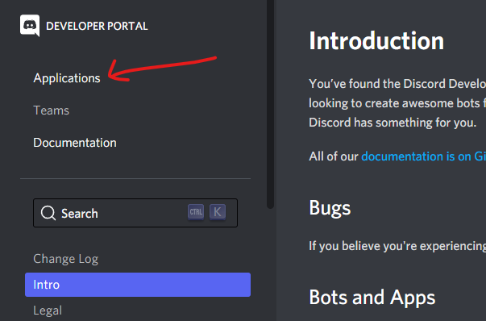
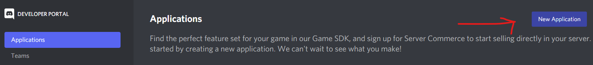

# Creating an Application

- [Creating an Application](#creating-an-application)
  - [Open 'Applications' in the Discord Developer Portal](#open-applications-in-the-discord-developer-portal)
  - [Create a New Application](#create-a-new-application)

## Open 'Applications' in the [Discord Developer Portal](https://discord.com/developers/docs)

## Create a New Application

